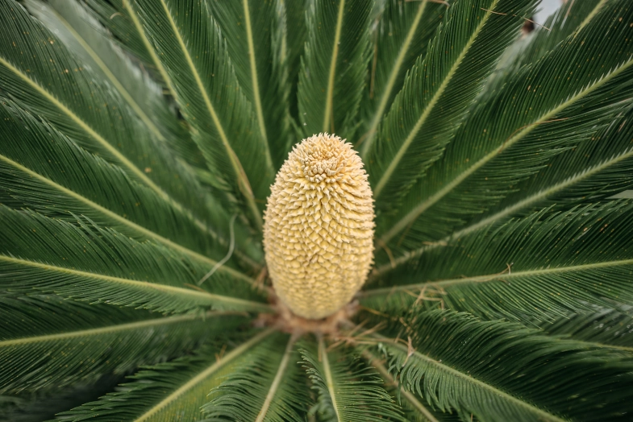
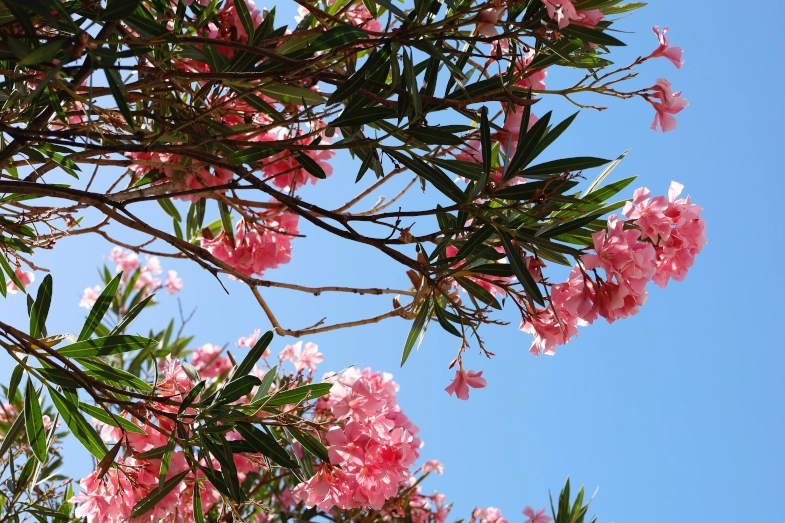
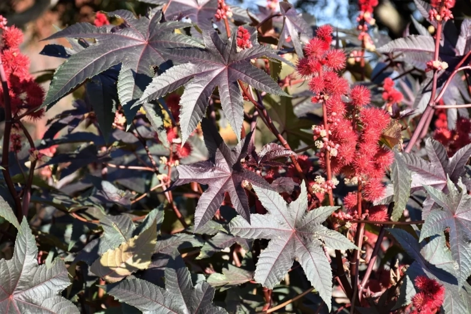
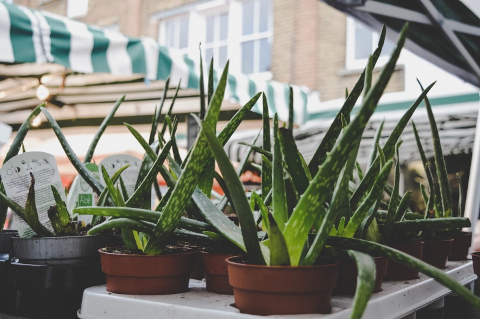
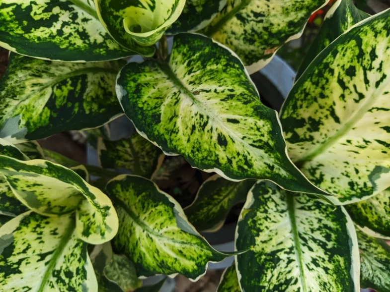

# 10 plants poisonous to dogs - Keeping your garden safe

As pet owners, we cherish our dogs and want to keep them safe and healthy. While we may be well aware of the dangers posed by certain foods and household items, the potential hazards of plants often go unnoticed. In this post, we will identify ten plants poisonous to dogs.

When we moved to our current house, we did a lot of work around the property to contain our dog—mainly building a solid fence around the property. My partner, an avid gardener, planted flowers, fruits, veggies, trees, you name it (yes, we have a big property). However, we never stopped to think that a plant could be harmful to our dog (and other pets we have). Until a friend came to visit the new house and was horrified that we had an oleander right in the part of the garden where our dog plays. Luckily, our dog was getting to his old years, so he wasn't interested in eating the flowers. Nevertheless, I dug out the oleander the weekend after our friend's visit.

Digging the plant out may have been an overreaction on our part. Still, by understanding the risks associated with these plants, we proactively protected our pets and created a secure environment for them. So, if you have a garden or live near a park, look out for the plants in this list and follow the tips at the end of this post.

## Azaleas and Rhododendrons

Azaleas and Rhododendrons are popular flowering plants known for their vibrant and eye-catching blooms. However, pet owners must exercise caution as these plants can be highly toxic to dogs. Azaleas and Rhododendrons contain poisonous substances known as grayanotoxins, primarily found in these plants' leaves, flowers, and nectar.

Grayanotoxins have a direct impact on the nervous system of dogs. When ingested, these toxins interfere with the normal functioning of sodium channels in nerve cells, disrupting nerve impulse transmission. This disruption can result in various poisoning symptoms, including gastrointestinal distress, drooling, weakness, tremors, seizures, and cardiac abnormalities.

The severity of the toxic effects depends on the number of grayanotoxins ingested and the size and overall health of the dog. Even small amounts of these toxins can significantly impact dogs, particularly smaller breeds or those with compromised health conditions.

## Lily

Lilies are renowned for their elegance and fragrances, making them popular for floral arrangements and gardens. Unfortunately, several species of lilies, including Easter lilies, tiger lilies, and day lilies, can be highly toxic to dogs.

The specific toxic components in lilies are still being studied, but it is known that various plant parts, such as flowers, leaves, stems, and even pollen, can harm dogs. When ingested, these toxic substances can cause severe toxic reactions.

One of the most dangerous consequences of lily ingestion in dogs is acute kidney failure. Even a tiny part of the lily plant can significantly damage the kidneys. The exact mechanism by which lilies cause kidney failure is not fully understood. Still, the toxic compounds are believed to directly affect the renal tubules, destroying and impairing kidney function.

## Sago Palm

With its striking appearance, the sago palm is a common ornamental plant found indoors and outdoors. However, few pet owners realise the grave danger it poses to dogs. The Sago Palms contains cycasin, a toxic compound that primarily affects the liver and can be fatal if ingested by dogs.

Cycasin is classified as a glycoside, specifically a beta-D-glycoside, and is primarily concentrated in the seeds of the Sago Palm. Once ingested by dogs, cycasin undergoes metabolic transformations in the body, ultimately releasing a potent toxin known as methylazoxymethanol (MAM). MAM interferes with DNA synthesis and disrupts cellular division, contributing to the development of liver lesions and, in severe cases, liver failure.

A dog consuming any part of the Sago Palm, such as the seeds, leaves, or roots, can lead to severe poisoning. Symptoms of Sago Palm poisoning in dogs typically include vomiting, diarrhoea, loss of appetite, weakness, jaundice (yellowing of the skin and eyes), abnormal bleeding, and, in severe cases, liver failure.

## Oleander

Oleander is popular in warmer climates due to its vibrant flowers and hardy nature. Yet, this seemingly harmless shrub harbours toxic compounds, including cardiac glycosides like oleandrin and nerioside. These toxic components can significantly impact a dog's health if ingested.

Oleandrin is a cardiac glycoside, a plant toxin that affects the cardiovascular system. When dogs ingest any part of the Oleander plant, such as the leaves, flowers, or stems, oleandrin interferes with the normal functioning of the heart muscle. It disrupts the delicate balance of electrolytes within the cardiac cells, leading to irregular heart rhythms and decreased heart rate. This interference with the heart's electrical signals can potentially cause life-threatening arrhythmias and even cardiac arrest in severe cases.

In addition to its impact on the heart, oleandrin can also affect other systems in a dog's body. Dogs that have ingested oleander may experience gastrointestinal symptoms such as drooling, vomiting, and diarrhoea. Weakness, loss of appetite, and abdominal pain may also occur. Furthermore, oleandrin can have neurologic effects, including disorientation, tremors, and seizures.

## Autumn Crocus

Often mistaken for the harmless spring crocus, the autumn crocus can significantly threaten your dog's health. All parts of the Autumn Crocus plant, including the bulbs, contain a toxic compound called colchicine.

Colchicine disrupts cell division and interferes with the function of microtubules, which are essential for cellular structures and processes. This disruption can lead to widespread damage and affect multiple organs. Colchicine poisoning in dogs can result in gastrointestinal symptoms, including vomiting, diarrhoea (which may be bloody), abdominal pain, and dehydration. However, the toxic effects of colchicine extend beyond the gastrointestinal tract.

The toxins in the plant can also cause bone marrow suppression, resulting in decreased production of red and white blood cells, leading to anaemia and increased susceptibility to infections. Additionally, colchicine can affect the liver and kidneys, leading to organ damage and impaired function.

## Daffodils

Daffodils, with their cheerful yellow blossoms, are commonly seen in gardens and parks during spring. However, pet owners should be cautious as various parts of the daffodil plant, including the bulbs, stems, and flowers, contain toxic compounds, such as lycorine and other alkaloids.

Lycorine can cause gastrointestinal symptoms such as drooling, vomiting, and diarrhoea. These symptoms may arise within a few hours of ingestion and can last several days. In some cases, dogs may also experience abdominal pain and loss of appetite.

The more concerning aspect of lycorine is its effect on the cardiovascular system. It can disrupt the normal functioning of the heart muscle and interfere with the electrical conduction system. In severe cases, this can result in irregular heart rhythms, decreased heart rate (bradycardia), and even cardiac arrest.

In addition to gastrointestinal and cardiovascular effects, lycorine may also have neurological impacts on dogs. Symptoms such as weakness, tremors, and seizures have been reported in cases of daffodil poisoning.

## Castor Bean Plant

The Castor Bean Plant is an ornamental plant found in gardens and landscapes. While its striking appearance may be appealing, it's crucial to know that all parts of the plant, especially the seeds, contain a highly toxic compound called ricin.

Ricin is a potent protein toxin that can be life-threatening and rapid to dogs, requiring immediate medical attention. Even a small amount of ingested seeds or plant material can have serious consequences. Once ingested, ricin interferes with protein synthesis within cells, leading to widespread cellular damage and disruption of normal physiological processes. The exact effects can vary depending on the amount of ricin ingested and the individual dog's size, sensitivity, and overall health.

In severe cases, ricin poisoning can result in organ failure, respiratory distress, collapse, and even death. Prompt veterinary intervention is crucial to mitigate the effects of ricin toxicity and provide supportive care.

## Tulips

Tulips are beloved spring flowers, but pet owners should be aware that they can be toxic to dogs if ingested. While tulips are not as toxic as other plants discussed in this post, such as lilies or daffodils, it is still important to take precautions. Ingestion of larger quantities of tulip bulbs or prolonged exposure to the plant may result in more severe symptoms.

Tulipalin A and tulipalin B are toxic compounds found in a tulip. The primary effect of these compounds is irritation and inflammation of the gastrointestinal tract. Dogs may experience gastrointestinal symptoms such as drooling, vomiting, and diarrhoea. These symptoms are usually temporary and subside within a few hours to a few days.

While these compounds are not considered highly toxic, it is important to note that larger quantities of tulip bulbs or prolonged exposure to the plant may lead to more severe symptoms. In rare cases, some dogs may experience allergic reactions, manifesting as skin irritations or respiratory distress.

## Aloe Vera

Aloe vera is a popular succulent plant known for its therapeutic properties. While aloe vera is generally considered to have low toxicity to dogs, pet owners should exercise caution as the gel inside aloe vera leaves contains saponin, which can be toxic to dogs if ingested in large quantities.

When ingested in significant amounts, saponins can cause gastrointestinal disturbances in dogs. These may include symptoms such as vomiting, diarrhoea, and abdominal discomfort. The severity of these effects can depend on factors like the dog's size, the concentration of saponins ingested, and individual sensitivity.

Additionally, aloe vera plants have sharp spines along the edges of their leaves, which can cause physical injury to a curious dog if they attempt to chew on or play with the plant.

## Dieffenbachia

Also known as Dumb Cane, Dieffenbachia leaves and stems contain insoluble calcium oxalate crystals, which are toxic to dogs. If a dog chews on or ingests any part of the plant, it can result in significant oral irritation and discomfort.

The effects of calcium oxalate crystals vary depending on the amount ingested and the individual dog's sensitivity. While Dieffenbachia poisoning is rarely fatal, some dogs may only experience mild symptoms, while others may have a more severe reaction.

When a dog chews on or bites into a plant containing calcium oxalate crystals, it cause a burning sensation and can result in oral discomfort, including excessive drooling, pawing at the mouth, and swelling of the lips, tongue, and throat. In severe cases, this can cause difficulty breathing or swallowing, requiring immediate veterinary attention.

If calcium oxalate crystals come into contact with the skin, it can cause irritation and dermatitis, resulting in redness, itching, and potentially blisters or sores.

## How to identify if your dog is poisoned

Dogs are creatures of habit. If you notice a change in your dog's daily routine or behaviour, something is going on. It may be simply a bug. But if you have one of the plants listed in this post, and you know or suspect your dog ingested them, look out for the following symptoms:

- **Gastrointestinal Distress**: Vomiting, diarrhoea (which may be bloody), excessive drooling, abdominal pain, and loss of appetite are common indicators of dog poisoning.
- **Neurological Symptoms**: Look for signs such as weakness, disorientation, tremors, seizures, muscle twitching, and difficulty walking or standing.
- **Changes in Breathing and Heart Rate**: Rapid or difficult breathing, irregular heart rate, and collapse may occur in some instances of poisoning, particularly those affecting the cardiovascular system.
- **Unusual Behavior**: If your dog exhibits sudden behavioural changes like agitation, restlessness, lethargy, or disinterest in surroundings, it could be a potential sign of poisoning.
- **Physical Symptoms**: Keep an eye out for pale gums, jaundice (yellowing of the skin and eyes), abnormal bleeding or bruising, and difficulty urinating.

Identifying if your dog has been poisoned and the possible cause of it is crucial to help your veterinarian provide prompt intervention and potentially life-saving measures. Based on the information you provide your veterinarian, they may choose to induce vomiting, administer activated charcoal, provide supportive care, or/and potentially hospitalise the dog for fluid therapy and other treatments that may be necessary.

## How to prevent your dog from getting poisoned

There are aspects you have control of and can take simple preventive actions. Others will be out of your control (dogs have their own brains, after all). So, there is no need to stress about it, but you must be diligent and aware of your dog's surroundings. It is all about minimising risks. Here are some specific steps you can take:

- **Research and identify toxic plants in your area.** Educate yourself about common toxic plants to dogs. The list in this post is a start, but you can find more in the references below.
- **Create a pet-friendly environment.** Keep toxic plants out of your dog's reach. Please place them in high, inaccessible areas or use hanging baskets. Alternatively, consider replacing poisonous plants with pet-safe alternatives.
- **Supervise outdoor activities.** When your dog is outside, keep a watchful eye on them to prevent them from nibbling on unfamiliar plants, flowers and objects in general.
- **Fence your yard.** Besides keeping your dog contained, a secure fence will restrict your dog's access to potentially toxic plants in neighbouring areas.
- **Train and use commands.** Teach your dog commands like "Leave it" and "Drop it" to discourage them from approaching or consuming unknown plants and dangerous items.
- **Leash walks.** Keep your dog on a leash during walks, especially in areas with a high concentration of plants or where you're uncertain about plant safety.
- **Be cautious with bouquets and floral arrangements.** Ensure that any bouquets or floral arrangements in your home do not contain toxic flowers or foliage that could harm your dog if ingested.
- **Learn the signs of poisoning.** Familiarise yourself with the common symptoms of plant poisoning as described in the previous paragraphs. If you suspect poisoning, contact your veterinarian immediately.

Remember, prevention is the key to keeping your dog safe from plant poisoning. By being proactive and taking necessary precautions, you can create a pet-friendly environment that minimises the risks.
